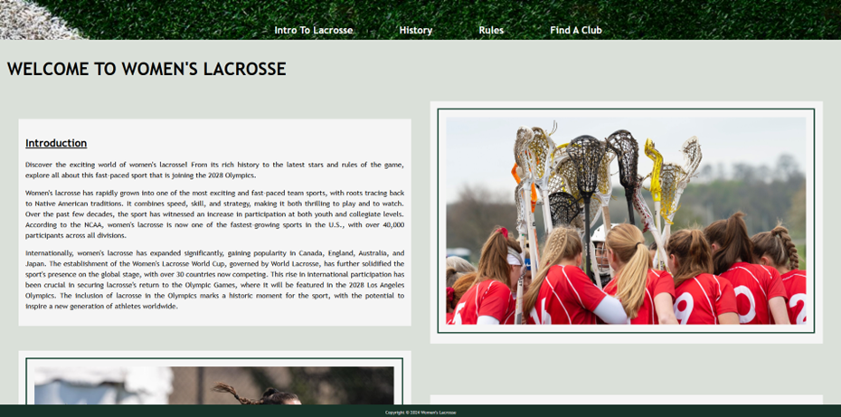
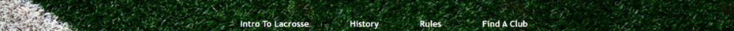
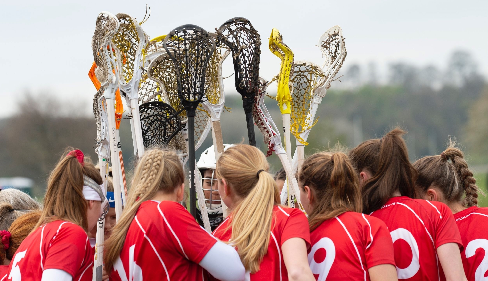
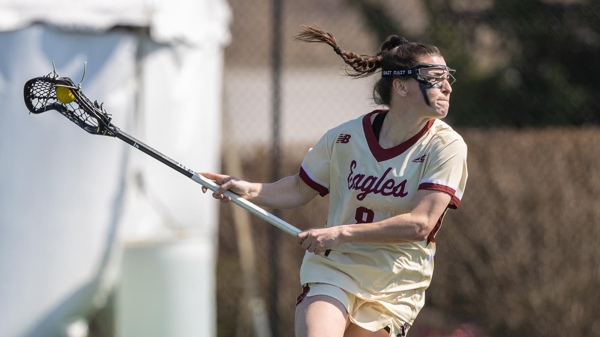
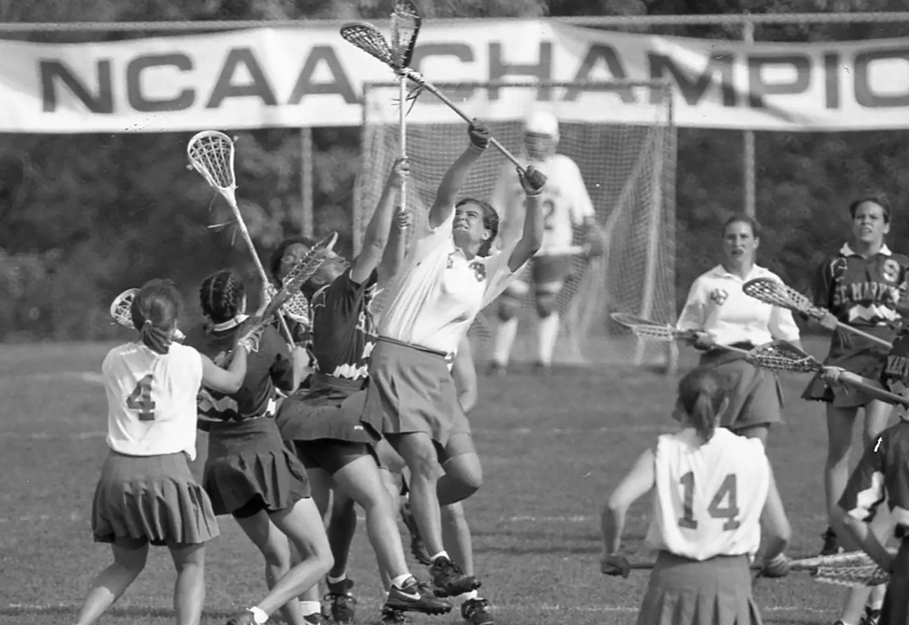
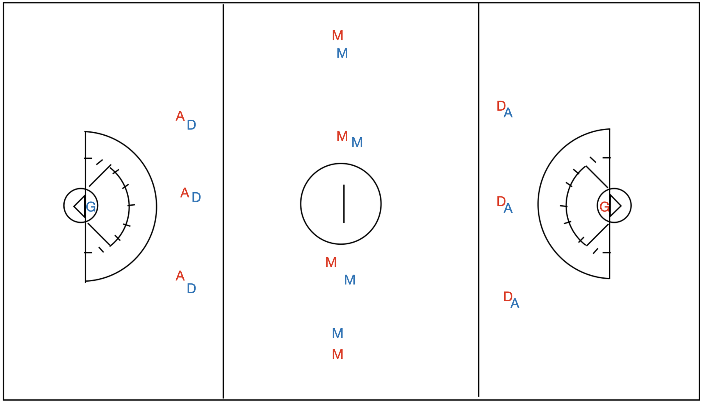

# Project1
A website on Women's Lacrosse

Project 1 for the Code Institute. Please visit the live site [here](https://github.com/katherinewadge-berrospi/Project1.git)

Contents
1. [Introduction](#introduction)
2. [Features](#features)
4. [Manual Testing](#testing)
6. [Deployment](#deployment)
6. [Future Features](#future)
7. [Credits](#credits) 

## Introduction

### Audience:
Women's Lacrosse is an informative website aimed at exposing the great sport to a wider audience. It raises awareness of  its rich history and how the sport has evolved over centuries. 

### Client side:
This site is easy to use with clear sections and a fixed navigation bar so they can easily go between pages. It uses simple yet flexible layouts that works on all devices. A consistent colour scheme and simple font design draws in the readerwhilst not distracting from the information. There is also a form where client users can upload their information and we provide a service to look for a local team suited to their needs.

## Features
Here are the core functions and elements that I integrated into the webiste.

### Navigation Bar

It is featured on all pages and fixed to the top for clear visibility at all times. A background photo that compliments the existing colour scheme is evident. The images provided show how the navigation bar changes in shape as the device width narrows, making it compatible on all devices. I used a hover element to further highlight the list elements in the navigation bar and used a font colour that was complimentary to the scheme and the background colour on the hover made the lettering very visible, further helping with client orientation.

### Images

I chose images that directly related to the content, women's lacrosse, which is different to men's and box lacrosse (different variations of the sport). On the home page, the England under 21's team pic brought a pop of colour to the page and highlighted the team bond aspect to the sport. The second image is of Charlotte North, who got her own section on the website as the current top player, demonstrating her athleticism and ferocity while playing her favourite sport. The last image is from the mid 1900's where the sport is becoming popular amongst women as it was origianlly deemed a man's sport. If you look closely the sticks they use are mostly old wooden ones, but there is one plastic stick in the midst.

The following image was used to highlight the pitch markings in the rules section of the wesbite. Additionally, the starting lineup is shown with "D", "M", "A", and "GK" to represent the positions and roles of the players.

Lastly, I included a background photo for the form to highlight its different structure to the rest of the website. Unfortunately, I did not manage to successfully change the file path to a relative one and had to keep to using the photos image address. 

### YouTube

I chose the short YouTube clip named "History of Lacrosse in 60 seconds" as it was relevant to the history section on the page with a simple timeline of the main events in the development of modern lacrosse, although it focuses more on the men's sport.

### Footer
I kept the footer simple, keeping it narrow and fixed to the bottom so it is coherent with the navigation bar as well as using complimentary fonts and colours.

### Form
The first fieldset is a place for clients to enter their details and all inputs are required. The seconds fieldset has 2 questions regarding their prior experience using radio and desired position they want to play using checkbox. The third fieldset is a space for any additional information that clients want to provide to help make the search for a suitable team/ club better. Lastly, the submit button was made larger and green to highlight were to submit with an additional red reset button alongside it in case they want to start the form again.

## Testing

### Validator Testing
Click [here](Assets/CSS-Validator.png) to see CSS validator for the style.css file.
Click [here](Assets/HTML-validator-index.html.png) to see HTML validator for the index.html file.
Click [here](Assets/HTML-validator-rules.html.png) to see HTML validator for the rules.html file.
Click [here](Assets/HTML-validator-form.html.png) to see HTML validator for the form.html file.

Errors were highlighted on the way and were fixed. Errors included stating a width in  which were deleted and were styled using the file style.css. Another error was that in the form.html file, there were repititions of the same id, so that was changed. In the Age drop down option, the first <option> did not have an empty value="" and so that was also added.

## Deployment
I deployed the site through GitHub, using the 'Pages' section in the repository's 'Settings' tab. Under the 'Source' dropdown, I selected the branch and set the folder to 'root' before saving. The site URL is provided under the green 'Code' button in the repository, which I copied into my browser and IDE. I tested the site on Chrome and Firefox, both of which displayed it correctly.
Please visit the live site by clicking [here](https://github.com/katherinewadge-berrospi/Project1.git)

-----------------------------------------------------------------------------------------------------------------------------------------------------------------------------

## Manual Testing
I used various methods to test the accessibility of my site and the quality of my code. The testing resulted in a number of error messages and suggestions which I took note of and implemented the necessary changes.

**Lighthouse**
1. Lighthouse alerted me to the button background colour and text contrast not being accessible on hover. I amended the buttons so that when the hover was activated the button not only changed colour but the text also switched to contrast well with the lighter green.
2. I added aria-labels to the navigation icons as Lighthouse flagged up that they were not accessible to screen readers.

## Future Features
1. Ideally, I would create my own videos for the site using original content and branded with Finance First.
2. I would add a privacy policy and a full disclaimer plus a data protection page to ensure the site was legally compliant with UK Data Protection laws.
3. I would set up the back end with an email provider to allow the email data to be filtered into a useful email database.
4. I would set up Google Analytics and a Facebook pixel to track where user traffic originated.
5. I would link the social media icons to Finance First social media sites.
6. I would add in an API which would track the financial markets to the homepage.
7. Create more favicon sizes for display on various screen sizes.

## Credits
**Wireframe:**
https://balsamiq.com/

**Nav bar icons:**
https://fontawesome.com/v4/

**Nav Bar code:**
https://www.w3schools.com/howto/howto_js_topnav_responsive.asp

**Mock Up:**
https://ui.dev/amiresponsive?url=https://katherine-holland.github.io/PP1-Finance-First/index.html

**Fonts:**
https://fonts.google.com/

**Buttons:**
https://www.w3schools.com/html/tryit.asp?filename=tryhtml_links_button_element 

**Sign Up Form**
https://www.youtube.com/watch?v=T2r0HSc4UlA

**Original footer GIF code:**
https://www.w3schools.com/html/tryit.asp?filename=tryhtml_images_hackman

**GIF by Zurich Schweiz, GIPHY:**
https://giphy.com/stickers/ZurichVersicherung-transparent-ODG034tmOF7O0IPLM7

## Images:
Unsplash:
Credit: Fabian Blank - https://unsplash.com/photos/pink-pig-figurine-on-white-surface-pElSkGRA2NU

Credit: Jeff Sheldon - https://unsplash.com/photos/turned-of-monitor-near-keyboard-and-mouse-9dI3g8owHiI

Credit: Markus Spiske - https://unsplash.com/photos/child-building-an-four-boxes-OO89_95aUC0

Credit: Micheile Henderson - https://unsplash.com/@micheile Plant in a money pot.

Credit: Vanessa Lee - https://unsplash.com/photos/hanged-pink-pig-coin-bank-TB5JdR7g8JM

## Website Validators:
https://validator.w3.org/

https://jigsaw.w3.org/css-validator/

Google Dev Tools - Lighthouse

## Favicon Creation:
https://favicon.io/favicon-converter/

Favicon image - author's own.

## Tutorials & Advice:
https://www.w3schools.com/

Code Institute - Love Running Tutorial

Code Chic: https://www.youtube.com/watch?v=T2r0HSc4UlA

Special thanks to my Mentor Spencer Barriball for his support and guidance.

