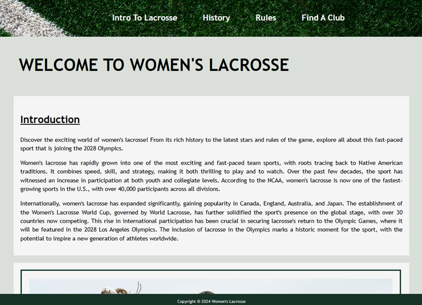
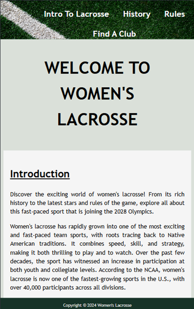

# Project1
A website on Women's Lacrosse.

Desktop:

Medium device (max width 992px):

Small device (max width 452px):

Project 1 for the Code Institute. Please visit the live site [here](https://github.com/katherinewadge-berrospi/Project1.git)

Contents:
1. [Introduction](#introduction)
2. [Features](#features)
3. [Testing](#testing)
4. [Deployment](#deployment)
5. [Future](#future)
6. [Credits](#credits) 

## Introduction

### Audience:
Women's Lacrosse is an informative website aimed at exposing the great sport to a wider audience. It raises awareness of  its rich history and how the sport has evolved over centuries. 

### Client side:
This site is easy to use with clear sections and a fixed navigation bar so they can easily go between pages. It uses simple yet flexible layouts that works on all devices. A consistent colour scheme and simple font design draws in the readerwhilst not distracting from the information. There is also a form where client users can upload their information and we provide a service to look for a local team suited to their needs.

## Features
Here are the core functions and elements that I integrated into the webiste.

### Navigation Bar

It is featured on all pages and fixed to the top for clear visibility at all times. A background photo that compliments the existing colour scheme is evident. The images provided show how the navigation bar changes in shape as the device width narrows, making it compatible on all devices. I used a hover element to further highlight the list elements in the navigation bar and used a font colour that was complimentary to the scheme and the background colour on the hover made the lettering very visible, further helping with client orientation.

### Images

I chose images that directly related to the content, women's lacrosse, which is different to men's and box lacrosse (different variations of the sport). On the home page, the England under 21's team pic brought a pop of colour to the page and highlighted the team bond aspect to the sport. The second image is of Charlotte North, who got her own section on the website as the current top player, demonstrating her athleticism and ferocity while playing her favourite sport. The last image is modern history, showing how the sport was becoming more popular amongst women as it was origianlly deemed a man's sport. If you look closely the sticks they use are a mix of old wooden sticks and plastic sticks.

The following image was used to highlight the pitch markings in the rules section of the wesbite. Additionally, there is a key which further improves a user's understanding of the game.

Lastly, I included a background photo for the form to highlight its different structure to the rest of the website. Unfortunately, I did not manage to successfully change the file path to a relative one and had to keep to using the photos image address. 

### YouTube

I chose the short YouTube clip named "History of Lacrosse in 60 seconds" as it was relevant to the history section on the page with a simple timeline of the main events in the development of modern lacrosse, although it focuses more on the men's sport.

### Footer
I kept the footer simple, keeping it narrow and fixed to the bottom so it is coherent with the navigation bar as well as using complimentary fonts and colours.

### Form
The first fieldset is a place for clients to enter their details and all inputs are required. The seconds fieldset has 2 questions regarding their prior experience using radio and desired position they want to play using checkbox. The third fieldset is a space for any additional information that clients want to provide to help make the search for a suitable team/ club better. Lastly, the submit button was made larger and green to highlight were to submit with an additional red reset button alongside it in case they want to start the form again.

## Testing

### Validator Testing
Click [here](Assets/CSS-Validator.png) to see CSS validator for the style.css file.

Click [here](Assets/HTML-validator-index.html.png) to see HTML validator for the index.html file.

Click [here](Assets/HTML-validator-rules.html.png) to see HTML validator for the rules.html file.

Click [here](Assets/HTML-validator-form.html.png) to see HTML validator for the form.html file.

Errors were highlighted on the way and were fixed. Errors included stating a width in  which were deleted and were styled using the file style.css. Another error was that in the form.html file, there were repititions of the same id, so that was changed. In the Age drop down option, the first <option> did not have an empty value="" and so that was also added.

### Lighthouse
For Desktop:

Click [here](Assets/Lighthouse-index.html-destop.png) for index.html.

Click [here](Assets/Lighthouse-rules.html-destop.png) for rules.html.

Click [here](Assets/Lighthouse-form.html-destop.png) for form.html.

For Mobile:

Click [here](Assets/Lighthouse-index.html.png) for index.html.

Click [here](Assets/Lighthouse-rules.html.png) for rules.html.

Click [here](Assets/Lighthouse-form.html.png) for form.html.

### Unfixed bugs
Whilst I managed to fix most bugs, there were some that fell throguh the cracks. The "Welcome to Women's Lacrosse" title is not central o nthe screen like the rules title. Additionallly, when trying to generate a mock up image that included a sample photo of the homescreen on different devices, my link would not work for unknown reasons, so instead I included separate image files in the ReadMe to illustrate how my website looks on different devices.

## Deployment
I deployed the site through GitHub, using the 'Pages' section in the repository's 'Settings' tab. Under the 'Source' dropdown, I selected the branch and set the folder to 'root' before saving. The site URL is provided under the green 'Code' button in the repository, which I copied into my browser and IDE. I tested the site on Chrome and Firefox, both of which displayed it correctly.
Please visit the live site by clicking [here](https://github.com/katherinewadge-berrospi/Project1.git)

## Future
1. An interactive map feature could be added that pinpoints the closest clubs to the clients location.
2. A full gallery could be added.
3. For a complete picture of the sport, include pages on box lacrosse and men's lacrosse and their current number 1 players.
4. Links to the full set of rules, but for this I would have to target a specific countries rules as they can differ.
5. Add more interactive features such as changing the nav bar list items into icons when on their page.

## Credits

### Images
https://images.squarespace-cdn.com/content/v1/59f9cf6de9bfdf609e447562/9c4b5903-a8ec-4ce4-8971-ac189c434326/230415+England+U21s+050.jpg
https://theacc.com/images/2022/6/2/North2.jpg
https://stanprucha.com/wp-content/uploads/2020/02/Artificial-Green-Grass-Football-Soccer-Field-Pitch-White-Stripe-Close-up-DSC01417-21-06-18.jpg
https://rdgusa.com/img/http/aHR0cHM6Ly9yZGctb3BlbmFzc2V0LnMzLmFtYXpvbmF3cy5jb20vb3BlbmFzc2V0LXYyL1IwMDI3LjQzNy4wMC9yMDAyNy40MzcuMDAtdW5pdmVyc2l0eS1vZi1mbG9yaWRhLWRvbmFsZC1yXzYzMzUwLmpwZw==?p=large&s=ccfe332afd04606111a749943a054d68
https://generalssports.com/images/2019/10/11/WLacrosse98004.jpg?width=1600&height=900&mode=max

### Video link:
https://www.youtube.com/watch?v=n1rvmAh155g

### Website Validators:
https://validator.w3.org/
https://jigsaw.w3.org/css-validator/
Google Dev Tools - Lighthouse

### Tutorials and avdvice:
https://www.youtube.com/watch?v=VyaHwvPWuZU
https://www.shecodes.io/athena/5516-adding-a-local-image-to-an-html-file#google_vignette
https://web.qhmit.com/css/flexbox/tutorial/create_a_website_layout_with_flexbox.cfm
https://www.w3schools.com/html/html_youtube.asp
https://www.w3schools.com/css/css3_backgrounds.asp
https://github.com/Code-Institute-Solutions/readme-template?tab=readme-ov-file
https://learn.codeinstitute.net/sandbox/api/challenges/60338cca9c4983ac5d855130/files/index.html#home

Thank you to my Mentor Spencer Barriball for his support.